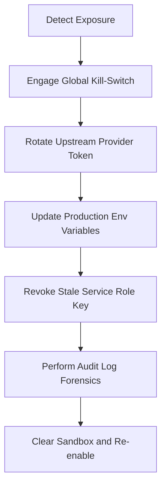

# Oye AI Operational Gateway: Disaster Recovery Runbooks
**Version**: 1.0.0  
**Classification**: Internal Technical Operations  
**Last Updated**: 2026-05-20  

This document contains 8 step-by-step, production-ready Disaster Recovery (DR) and Incident Response Runbooks for the Oye AI system architecture. These Standard Operating Procedures (SOPs) are designed to guide site reliability engineers (SREs), system operators, and developers through active service disruptions, mitigating customer downtime and restoring platform integrity.

---

## Runbook 1: Redis Outage

### Incident Indicators & Symptoms
* Webhook ingestion latency spikes; memory usage alerts triggered on the cluster.
* Inability of BullMQ workers to retrieve or lock background jobs.
* Express/Next.js routes logging connection refused error messages for Redis endpoints:
  `[Redis] Connection refused to 127.0.0.1:6379`
* Temporary fallback to V8 in-memory queues is engaged automatically, visible in telemetry.

### Triage & Diagnostics
1. **Check Local/Internal Redis Status**:
   Determine if the Redis host daemon is running:
   ```bash
   # On Windows (PowerShell)
   Get-Service -Name "Redis" or Get-Process -Name "redis-server"
   
   # On Linux hosts
   systemctl status redis-server
   ```
2. **Ping Redis Server**:
   Verify network connection using redis-cli:
   ```bash
   redis-cli -u redis://127.0.0.1:6379 ping
   ```
3. **Verify Memory Exhaustion**:
   Check if Redis has reached `maxmemory` constraints:
   ```bash
   redis-cli info memory | grep "maxmemory"
   ```

### Resolution Procedures

#### Scenario A: Redis Process Crashed or Offline
1. **Restart the Service**:
   ```bash
   # Linux SRE Action
   sudo systemctl restart redis-server
   
   # Windows SRE Action
   Restart-Service -Name "Redis"
   ```
2. **Confirm Socket Connection**:
   Ensure Redis is bound to the correct port (6379 by default) and listening:
   ```bash
   netstat -ano | findstr 6379
   ```

#### Scenario B: Redis Out-Of-Memory (OOM) Lockout
1. **Flush Expired or Telemetry Keys**:
   If Redis is locked due to memory saturation, log in and purge non-essential telemetry structures:
   ```bash
   redis-cli
   > AUTH your_redis_secret_password
   > EVAL "return redis.call('del', unpack(redis.call('keys', 'telemetry:ai:provider:*')))" 0
   > EVAL "return redis.call('del', unpack(redis.call('keys', 'telemetry:org:*:tokens')))" 0
   ```
2. **Increase Volatile Eviction Policies**:
   Temporarily switch the eviction policy to aggressively dump least-recently-used keys with TTLs:
   ```bash
   redis-cli config set maxmemory-policy volatile-lru
   ```
3. **Permanent Mitigations**:
   * Scale the Redis instance via your hosting provider console (e.g., Upstash, AWS ElastiCache, Heroku Redis).
   * Double the `maxmemory` setting in `redis.conf` if hosting on bare-metal.

---

## Runbook 2: BullMQ Worker Crash

### Incident Indicators & Symptoms
* BullMQ incoming messages queue sizes growing continuously (`incoming_messages` wait length > 50).
* Telemetry tab dashboard displaying **stale** worker status for `worker-node-1a`, `worker-node-2b`, etc.
* WhatsApp replies are not dispatching to end-users (no response generated), but database messages record inbound entries perfectly.

### Triage & Diagnostics
1. **Inspect Worker Activity**:
   Check the `activeWorkers` telemetry output to identify which worker IDs stopped renewing their heartbeats.
2. **Query Database for Backlog**:
   Run a diagnostic SQL query to verify pending messages count:
   ```sql
   SELECT COUNT(*) FROM incoming_messages WHERE status = 'pending';
   ```
3. **Check Crash Dumps and Console Output**:
   Access the supervisor logs (e.g., PM2, Docker, systemd) to discover exceptions:
   ```bash
   docker logs oye-worker-service --tail 100
   # Look for heap out-of-memory or database pool exhaustion errors.
   ```

### Resolution Procedures

#### 1. Graceful Process Recycles
Restart the crashed service container or background daemon process:
```bash
# If running inside PM2
pm2 restart oye-worker

# If running inside Docker/Kubernetes
docker restart oye-worker-container
kubectl rollout restart deployment/worker-deployment
```

#### 2. Clear Stuck Job Locks
If a worker crashed while holding a Redis lock on a job, it may prevent other workers from processing it immediately.
* Log into the Admin Command Center dashboard.
* Click on the **Dead-Letter Queue (DLQ)** or use redis-cli to remove orphaned locks:
  ```bash
  redis-cli del "bull:incoming_messages:stalled"
  ```

#### 3. Scale Consumer Threads
If queue saturation remains high (>100 messages) after restart, scale out the consumer threads:
* Add additional worker nodes in the server dashboard or spin up local standby daemons:
  ```bash
  # Spawn an additional isolated BullMQ thread in background
  node dist/workers/incoming-messages-processor.js &
  ```

---

## Runbook 3: AI Provider Outage & Failovers

### Incident Indicators & Symptoms
* Spike in failed dispatches or retry attempts in observability metrics.
* API completions logs showing HTTP status codes `502`, `503`, or `429` (Rate Limited) from primary providers.
* Centralized Provider Reliability SLA table indicating a drop in `uptime_ratio` for a specific model (e.g., `langdock` or `openai` drops below 95%).

### Triage & Diagnostics
1. **Identify the Failing Provider**:
   Inspect the Admin dashboard **Centralized Provider Reliability SLA Scores** grid to compare latencies and error counts between Langdock, OpenAI, Anthropic, and Gemini.
2. **Review Failover Ledger**:
   Observe the `failover_count` column. If failovers are actively engaging, the failover mitigation engine is functioning correctly but may require manual routing override.
3. **Trace API Exceptions**:
   Query the `provider_sla_logs` database table for the exact HTTP error payload:
   ```sql
   SELECT provider, error_message, latency_ms, created_at 
   FROM provider_sla_logs 
   WHERE success = false 
   ORDER BY created_at DESC 
   LIMIT 10;
   ```

### Resolution Procedures

#### Scenario A: Automated Failover Active (Normal Flow)
No direct intervention required. The system's routing mechanism automatically diverts traffic from the offline provider to the designated secondary provider (e.g., Langdock $\rightarrow$ OpenAI $\rightarrow$ Gemini fallback hierarchy).
* Monitor the `provider_reliability_scores` table to ensure the fallback target is maintaining a high success rate.

#### Scenario B: Global Outage (All Primary Providers Down)
If massive upstream outages affect both OpenAI and Anthropic simultaneously:
1. **Activate Secondary Standby Gateways**:
   Edit `src/lib/services/ai.ts` or set the environment variables to route directly to Gemini or a self-hosted LLM endpoint:
   ```env
   DEFAULT_AI_PROVIDER="gemini"
   FORCE_FAILOVER_TARGET="gemini"
   ```
2. **Downtime Notification Trigger**:
   If no responsive LLM engines are reachable, deploy a temporary custom static auto-reply for incoming messages to prevent dead silence:
   ```env
   EMERGENCY_STATIC_AUTO_REPLY="Lo sentimos, nuestro motor de respuesta inteligente está experimentando un mantenimiento de red. Responderemos a la brevedad."
   ```

---

## Runbook 4: Meta WhatsApp Outage

### Incident Indicators & Symptoms
* Meta outbound webhooks returning `500 Internal Server Error` or timing out.
* Outbound message dispatches fail repeatedly, moving messages into the **Dead-Letter Queue (DLQ)** with errors:
  `Meta API Error: 100 - Invalid parameter` or `Meta Service Unavailable`.
* Customer complaints of sent messages showing single ticks indefinitely.

### Triage & Diagnostics
1. **Check Meta Platform Status**:
   Visit the [Meta Status Dashboard](https://developers.facebook.com/status/) to verify active outages on the WhatsApp Business API.
2. **Review Inbound Webhook Signature Status**:
   Verify that webhooks from Meta are arriving but failing signature validation. Check `whatsapp/route.ts` logs for `Invalid webhook signature` warnings.
3. **Check Channel Block status**:
   Ensure the business phone number hasn't been flagged or restricted due to spam policies or billing issues in the Facebook Business Manager.

### Resolution Procedures

#### Scenario A: Meta API Outage (Upstream Downtime)
1. **Pause Outbound Dispatches**:
   To prevent token exhaustion and rate-limiting blocks during downstream re-connection, engage the **Emergency Outbound Kill Switch**:
   ```env
   DISABLE_OUTBOUND_WHATSAPP=true
   ```
   *This immediately halts all outbound HTTP calls to Meta, protecting queue reliability.*
2. **Accumulate Inbound Queue**:
   Allow inbound webhook messages to accumulate safely in the PostgreSQL database. Set workers to hold messages rather than attempt failing dispatches.
3. **Post-Outage Recovery Plan**:
   Once Meta status is green, remove the kill switch (`DISABLE_OUTBOUND_WHATSAPP=false`) and run the DLQ Replay script to process accumulated tasks:
   ```bash
   # Replay all pending DLQ items
   curl -X POST -H "Authorization: Bearer ADMIN_TOKEN" http://localhost:3000/api/queues/dlq/replay-all
   ```

#### Scenario B: Token Expiration / Phone Disconnection
1. **Re-authenticate system credential**:
   Generate a new Permanent System User Token in the Meta Developer Console.
2. **Update Environment Variable**:
   Replace the stale token in your production environment config:
   ```env
   WHATSAPP_ACCESS_TOKEN="EAAG..."
   ```
3. **Restart application processes** to ensure the new token is loaded into server memory.

---

## Runbook 5: Stripe Webhook Processing Outage

### Incident Indicators & Symptoms
* Stripe billing status synchronizations failing.
* Customers completing checkouts but their tenant `billing_status` remains `trial` or `canceled`, causing billing-related lockouts.
* Error logs pointing to `/api/webhooks/stripe`:
  `Stripe Webhook signature verification failed` or `400 Bad Request`.

### Triage & Diagnostics
1. **Check Stripe Developer Dashboard**:
   Log into the Stripe Console, navigate to Developers $\rightarrow$ Webhooks, and inspect the delivery attempts for your webhook endpoint URL.
2. **Inspect Signature Key**:
   Verify if the `STRIPE_WEBHOOK_SECRET` matches the signature key shown in the Stripe console. A mismatch is the #1 cause of signature failures.
3. **Inspect Payload Delivery History**:
   Look for failed event payloads (e.g., `invoice.payment_failed`, `customer.subscription.deleted`) and copy their JSON structures for local replaying.

### Resolution Procedures

#### 1. Reconcile Webhook Key
If signature validation fails, immediately retrieve the fresh signing secret from Stripe and update the server:
```env
STRIPE_WEBHOOK_SECRET="whsec_..."
```
Restart web nodes to re-initialize the Stripe client.

#### 2. Manual Billing Status Override (Emergency Mitigation)
To unblock a customer whose subscription was paid but webhook failed to sync, manually override their billing status in the database to prevent service lockout:
```sql
UPDATE organizations 
SET billing_status = 'active', status = 'active' 
WHERE id = 'tenant_uuid_here';
```
*Always log this action in the security audit ledger.*

#### 3. Replay Failed Stripe Webhook Events
* Locate the failed event ID in the Stripe Developer Dashboard under the webhook attempt list.
* Select the event and click **Resend**. Stripe will re-dispatch the payload to `/api/webhooks/stripe`.
* Verify that the tenant's `billing_status` updates to `active` or `trial` instantly.

---

## Runbook 6: Compromised Secrets Escalation

### Incident Indicators & Symptoms
* Unauthorized requests identified in the Platform Audit Logs tab.
* Rogue API completions or token usage billed to unknown endpoints.
* Alerts from GitHub Token Scanning or Meta Developer Security regarding exposed API tokens.

### Triage & Diagnostics
1. **Identify the Leaked Secret**:
   Determine which credential has been exposed (e.g., `SUPABASE_SERVICE_ROLE_KEY`, `WHATSAPP_ACCESS_TOKEN`, `STRIPE_SECRET_KEY`, `LANGDOCK_API_KEY`).
2. **Determine Penetration Scope**:
   Inspect database traffic logs to identify if unauthorized database mutations or read events occurred via exposed service role keys:
   ```sql
   SELECT * FROM audit_logs ORDER BY created_at DESC LIMIT 100;
   ```

### Resolution Procedures

> [!CAUTION]
> **COMPROMISED SECRETS ARE MAXIMUM EMERGENCY LEVEL SEVERITY.**  
> Immediately initiate the following escalation sequence. Do not delay rotations.



#### Step 1: Revoke and Regene In-Platform
* **Meta/WhatsApp Key**: Revoke the current system user token in Facebook Business Settings. Generate a new key.
* **Supabase Service Key**: Go to Supabase Settings $\rightarrow$ API, and click **Roll Key** for the `service_role` key.
* **Stripe Secret Key**: In the Stripe Dashboard, roll the compromised secret API key. Set the expiration of the old key to **1 Hour** to allow outstanding webhook completions to finish if possible, or revoke immediately if actively abused.

#### Step 2: Inject New Production Secrets
* Log into the production environment manager (e.g., Vercel, AWS Secrets Manager, local `.env`).
* Update the compromised variables with the newly rolled strings.
* Trigger a production deploy and force-restart all background queues and workers to purge stale memory environments.

#### Step 3: Assess Leak Footprint
* Run database audit checks to verify if new admin accounts were inserted during the compromise period:
  ```sql
  SELECT email, created_at FROM auth.users ORDER BY created_at DESC LIMIT 5;
  ```

---

## Runbook 7: Webhook DDoS/Rate-Limit Attack

### Incident Indicators & Symptoms
* Severe latency spikes on the `/api/webhooks/whatsapp` entry points (>5000ms response times).
* Server resources (CPU, Memory) pinned at 98-100% capacity in the observability diagnostics.
* Large volume of requests originating from a single IP range or targeting invalid phone numbers.

### Triage & Diagnostics
1. **Analyze Webhook Request Source**:
   Identify the incoming traffic pattern. Meta webhooks originate from official Meta IP address ranges. Any request claiming to be a Meta webhook but coming from an arbitrary hosting provider (e.g., AWS, DigitalOcean, OVH) is spoofed.
2. **Verify Signature Rejection Rate**:
   Verify that signature authentication filters (`whatsapp/route.ts`) are rejecting the requests but are bottlenecked on cryptographic compute tasks.

### Resolution Procedures

#### 1. Shift Signature Validation to Edge/CDN
If the application servers are saturated by validation attempts, configure the Edge Gateway (e.g., Cloudflare, Vercel Edge Rules, NGINX) to validate the header signature or block requests from non-Meta IPs:
* Meta IP Ranges can be looked up dynamically via the Facebook API. Whitelist only these ranges for `/api/webhooks/whatsapp` endpoints.
* *Standard Meta IP Ranges Whitelist rule inside NGINX/Cloudflare WAF:*
  `129.134.0.0/16`, `157.240.0.0/16`, `173.252.0.0/16`, `185.89.216.0/22`, `31.13.24.0/21`

#### 2. Terminate Malicious Connections at NGINX/Cloudflare
If a spoofed DDoS attack is identified, deploy WAF rules immediately:
```bash
# Example Cloudflare WAF expression to block spoofed webhooks:
(http.request.uri.path contains "/api/webhooks" and not ip.src in $meta_ip_ranges) -> BLOCK
```

#### 3. Throttle Webhook Threads
If legitimate traffic spikes are overwhelming the system, configure BullMQ's rate-limiting properties dynamically in Redis:
```bash
redis-cli
> HSET "bull:incoming_messages:settings" "rateLimit" 50
# Throttles incoming_messages queue processing to maximum 50 jobs per second
```

---

## Runbook 8: Tenant Suspension & Support Escalation

### Incident Indicators & Symptoms
* A tenant workspace is compromised, spamming end-users, or has committed credit/payment fraud.
* Platform administrator triggers a manual lifecycle suspension or Stripe flags a customer subscription as `suspended` or `canceled`.
* Support ticket created requesting urgent escalation to freeze a tenant gateway.

### Triage & Diagnostics
1. **Verify Organization State**:
   Access the **Tenants & Approvals** tab of the Admin dashboard. Look up the organization slug and check the lifecycle `status` (e.g. `active`, `suspended`, `pending_approval`) and `billing_status` (e.g., `suspended`, `canceled`, `trial`).
2. **Check Operational Gates**:
   Ensure the AI Responder routing gate is active. Suspended organizations must not process any inbound or outbound messages, nor initiate AI model generations.

### Resolution Procedures

#### Scenario A: Urgent Platform Administration Suspension (Security Freeze)
1. **Freeze Lifecycle State**:
   Log into the Global Command Center. In the **Tenants & Approvals** tab, locate the rogue tenant and click **Suspend**.
   *This changes the database `organizations.status` to `'suspended'` instantly.*
2. **Confirm Gate Activation**:
   Verify in database telemetry that further inbound webhooks for this organization are discarded:
   ```sql
   SELECT id, status, billing_status FROM organizations WHERE slug = 'rogue-tenant-slug';
   ```
3. **Escalate to Support Queue**:
   Open an internal investigation ticket and log the reason for suspension in the admin ledger:
   ```sql
   INSERT INTO audit_logs (action, actor_id, details) 
   VALUES ('tenant_suspension', 'admin_uuid', '{"org_slug": "rogue-tenant", "reason": "High spam volume reported / active security review"}');
   ```

#### Scenario B: Billing-Related Suspension (Stripe Auto-Lockout)
1. **Verify Decoupled Stripe status**:
   Ensure `organizations.billing_status` is updated to `'suspended'` or `'canceled'` by Stripe's webhook in the database.
2. **Review Client Warning Flow**:
   When a tenant's billing status is `'past_due'`, they should not be blocked from sending messages, but an alert must show up in their local workspace dashboard. Confirm the state in `ai.ts` is allowing replies but logging warning notifications.
3. **Unlocking Subscription**:
   Once the customer updates their card on Stripe, wait for the Stripe webhook `customer.subscription.updated` to transition `billing_status` back to `'active'`. The system will automatically resume their AI dispatcher flows without administrator intervention.

---

## Operational SLA Contact Sheet

| Escalation Level | Responsible Department | Target Response Time | Contact Channel |
| :--- | :--- | :--- | :--- |
| **L1 Operations** | SRE Standby Engineer | < 15 Minutes | Slack `#ops-emergency` / PagerDuty |
| **L2 Engineering** | Backend Core Team | < 30 Minutes | Teams `#eng-tier-2` |
| **L3 Administration** | Security / Platform Lead | Urgent Escalation | Direct Secure Hot-line |
